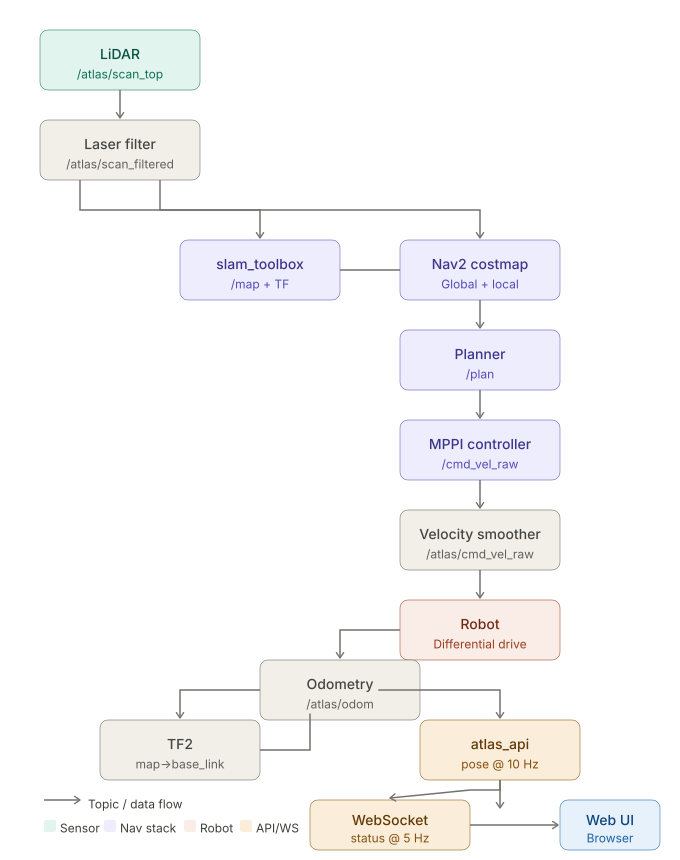
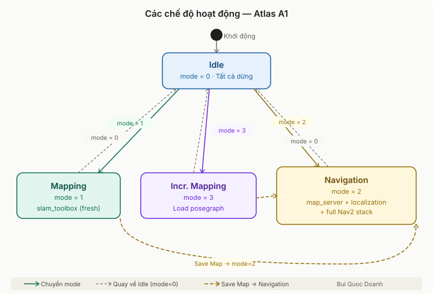
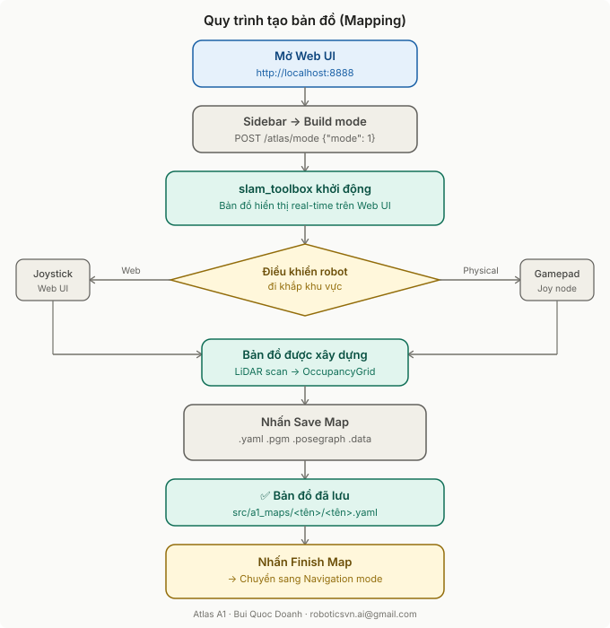
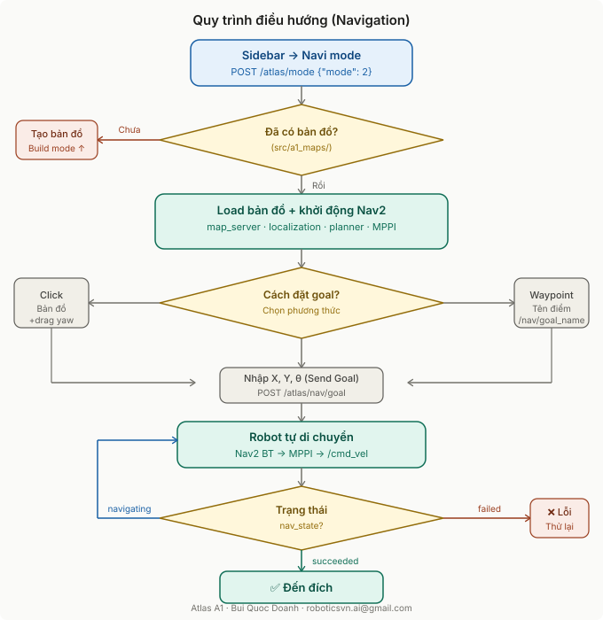
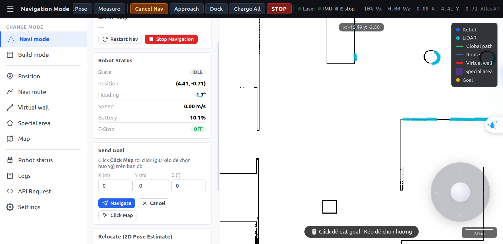

# Atlas Robot A1 — Hướng dẫn sử dụng (Simulation)

**Author:** Bui Quoc Doanh  
**Contact:** roboticsvn.ai@gmail.com  
**Platform:** ROS 2 Humble · Gazebo Classic · Nav2 · slam_toolbox  

---

## Mục lục

1. [Giới thiệu](#1-giới-thiệu)
2. [Thông số kỹ thuật](#2-thông-số-kỹ-thuật)
3. [Kiến trúc hệ thống](#3-kiến-trúc-hệ-thống)
4. [Tính năng](#4-tính-năng)
5. [Cài đặt & Build](#5-cài-đặt--build)
6. [Hướng dẫn sử dụng](#6-hướng-dẫn-sử-dụng)
7. [Giao diện Web UI](#7-giao-diện-web-ui)
8. [REST API nhanh](#8-rest-api-nhanh)
9. [Cấu trúc packages](#9-cấu-trúc-packages)
10. [Troubleshooting](#10-troubleshooting)

---

## 1. Giới thiệu

**Atlas A1** là robot tự hành bánh xe sai biệt (differential drive), được phát triển trên nền tảng ROS 2. Hệ thống tích hợp đầy đủ từ phần cứng (hoặc mô phỏng Gazebo) đến giao diện web điều khiển, cho phép:

- **Xây dựng bản đồ** môi trường tự động bằng LiDAR
- **Điều hướng tự chủ** đến mục tiêu bất kỳ trên bản đồ
- **Lập lịch tuyến đường** (route) qua nhiều điểm waypoint
- **Điều khiển từ xa** qua trình duyệt web hoặc joystick
- **Quản lý vùng đặc biệt** (cấm, giảm tốc) và tường ảo


---

## 2. Thông số kỹ thuật

### Robot (URDF / thực tế)

| Thông số | Giá trị |
|---------|--------|
| **Loại di chuyển** | Differential drive (2 bánh chủ động + 2 bánh tự lựa) |
| **Kích thước (D×R×C)** | 400 × 300 × 100 mm |
| **Bán kính an toàn** | 300 mm |
| **Bán kính bánh xe** | 33 mm |
| **Tốc độ tối đa** | 0.7 m/s (tuyến tính) · 2.0 rad/s (góc) |
| **Khối lượng** | ~1.1 kg |

### Cảm biến

| Cảm biến | Thông số |
|---------|---------|
| **LiDAR** | 360° · 720 tia · 10 Hz · range 0.1–30 m |
| **Camera** | RGB · tích hợp Gazebo (tùy chọn) |
| **Odometry** | Encoder bánh xe (Gazebo differential drive plugin) |

### Phần mềm

| Thành phần | Phiên bản / Công nghệ |
|-----------|----------------------|
| **OS** | Ubuntu 22.04 |
| **ROS 2** | Humble Hawksbill |
| **Simulator** | Gazebo Classic 11 |
| **SLAM** | slam_toolbox (async) |
| **Navigation** | Nav2 + MPPI Controller |
| **API** | Flask (REST :8080) + WebSocket (:9090) |
| **Web UI** | HTML/CSS/JS thuần (port :8888) |

---

## 3. Kiến trúc hệ thống

### 3.1 Sơ đồ tổng thể


### 3.2 Luồng dữ liệu chính


### 3.3 TF Tree

```
world
  └── map
        └── odom
              └── base_link
                    ├── chassis
                    │     ├── left_wheel
                    │     ├── right_wheel
                    │     ├── caster_wheel_front_left
                    │     ├── caster_wheel_front_right
                    │     ├── lidar_top_link      ← /atlas/scan_top
                    │     └── camera_link
                    └── (connector links)
```

### 3.4 Các chế độ hoạt động



---

## 4. Tính năng

### 4.1 Xây dựng bản đồ (SLAM Mapping)

```
┌─────────────────────────────────────────────────────┐
│                   SLAM Mapping                      │
│                                                     │
│  Robot di chuyển → LiDAR scan → slam_toolbox        │
│                                                     │
│  ○ Fresh Mapping    — tạo bản đồ hoàn toàn mới      │
│  ○ Incremental      — mở rộng bản đồ đã có          │
│                                                     │
│  Lưu ra: .yaml + .pgm + .posegraph + .data          │
└─────────────────────────────────────────────────────┘
```

- Dùng `slam_toolbox` async mode
- Posegraph được lưu để có thể tái sử dụng (incremental mapping)
- Loop closure tùy chỉnh
- Lưu bản đồ qua Web UI hoặc API

### 4.2 Điều hướng tự chủ (Autonomous Navigation)

```
┌─────────────────────────────────────────────────────┐
│                Navigation Stack                     │
│                                                     │
│  map_server ──► localization (slam_toolbox)         │
│                      │                              │
│              Global Costmap                         │
│              Local  Costmap                         │
│                      │                              │
│  Goal ──► BT Navigator ──► Planner (NavFn)          │
│                              │                      │
│                    MPPI Controller ──► /cmd_vel      │
│                              │                      │
│                    Velocity Smoother                 │
│                    Collision Monitor                 │
└─────────────────────────────────────────────────────┘
```

| Tính năng | Mô tả |
|----------|-------|
| **Point navigation** | Di chuyển đến tọa độ (x, y, θ) bất kỳ |
| **Waypoint navigation** | Di chuyển đến waypoint đã đặt tên |
| **Route execution** | Thực thi chuỗi waypoints (có thể lặp) |
| **Auto-replan** | Lập lại kế hoạch khi gặp chướng ngại vật động |
| **Collision avoidance** | Dừng khẩn cấp khi vật cản quá gần |
| **Auto-charging** | Tự động về trạm sạc (approach + dock) |

### 4.3 Tường ảo & Vùng đặc biệt

```
┌──────────────── Bản đồ ────────────────────────────┐
│                                                     │
│   ████████  ← Tường thật (OccupancyGrid)            │
│                                                     │
│   ═════════  ← Virtual Wall (tường ảo)              │
│              Robot không được đi qua                │
│                                                     │
│   ░░░░░░░░   ← Slow Zone (giảm 50% tốc độ)         │
│                                                     │
│   ▓▓▓▓▓▓▓▓  ← Forbidden Area (cấm hoàn toàn)       │
│                                                     │
└─────────────────────────────────────────────────────┘
```

### 4.4 Điều khiển thủ công

- **Web Joystick** — nút kéo ảo góc dưới phải màn hình
- **REST API** — `POST /atlas/chassis/move {vx, vy, wz}`
- **Gamepad vật lý** — qua `joy` + `teleop_twist_joy` (a1_joystick)
- **Keyboard** — qua `teleop_twist_keyboard` (tùy chọn)

---

## 5. Cài đặt & Build

### 5.1 Yêu cầu

```bash
# ROS 2 Humble
sudo apt install ros-humble-desktop

# Nav2
sudo apt install ros-humble-navigation2 ros-humble-nav2-bringup

# slam_toolbox
sudo apt install ros-humble-slam-toolbox

# Gazebo
sudo apt install ros-humble-gazebo-ros-pkgs

# Laser filters
sudo apt install ros-humble-laser-filters

# Topic tools
sudo apt install ros-humble-topic-tools

# Python deps
pip3 install flask websockets
```

### 5.2 Build

```bash
cd ~/atlas_robot
colcon build --symlink-install
source install/setup.bash
```

### 5.3 Build một package

```bash
colcon build --packages-select a1_bringup a1_slam atlas_api atlas_web
source install/setup.bash
```

---

## 6. Hướng dẫn sử dụng

### 6.1 Khởi động hệ thống Simulation

```bash
source ~/atlas_robot/install/setup.bash

# Khởi động toàn bộ (Gazebo + API + Web UI)
ros2 launch a1_bringup a1_bringup_sim.launch.py
```

Các thành phần được khởi động:

```
a1_bringup_sim.launch.py
├── a1_description/a1_simulation.launch.py
│   ├── Gazebo (warehouse.world)
│   ├── robot_state_publisher (URDF)
│   └── spawn_entity (Atlas A1)
├── a1_bringup/a1_laser_filter.launch.py
│   └── scan_to_scan_filter_chain
├── a1_bringup/a1_joystick.launch.py
│   └── joy + teleop_twist_joy
├── a1_bringup/a1_fake_status.launch.py
│   └── fake battery, power, version publishers
├── odom_relay (/odom → /atlas/odom)
├── atlas_api/atlas_api_sim.launch.py
│   └── REST :8080 · WebSocket :9090
└── atlas_web/atlas_web.launch.py
    └── Static server :8888
```

### 6.2 Mở Web UI

Sau khi launch xong (~10 giây), mở trình duyệt:

```
http://localhost:8888
```

hoặc từ máy khác trong cùng mạng:

```
http://<robot-ip>:8888
```

### 6.3 Tạo bản đồ mới



**Cách thực hiện từng bước:**

1. Sidebar → **Build mode**
2. Gazebo/Rviz hiển thị robot và bản đồ đang build
3. Điều khiển robot bằng **joystick web** (kéo nút tròn góc dưới phải)
4. Đi hết khu vực cần map
5. Click **Save Map** → nhập tên (ví dụ: `Warehouse Floor 1`)
6. Click **Finish Map** → hệ thống chuyển sang Navigation mode

### 6.4 Điều hướng



**Đặt goal bằng chuột trên bản đồ:**

```
1. Toolbar → [Navi Goal]
2. Click vào vị trí đích trên bản đồ
   → Robot bắt đầu di chuyển ngay
3. Hoặc: Click + giữ + kéo
   → Chọn hướng robot khi đến nơi
```

### 6.5 Relocate (đặt lại vị trí)

Khi robot bị lạc vị trí (localization sai):

```
1. Toolbar → [Set Pose]
2. Click vào vị trí thực của robot trên bản đồ
3. Click + kéo để chỉ hướng
→ slam_toolbox cập nhật lại vị trí
```

### 6.6 Thêm Waypoints

```
1. Sidebar → Position
2. Click [Pick on Map] → Click vị trí trên bản đồ
   hoặc nhập X, Y, θ thủ công
3. Nhập tên waypoint (VD: "Desk A", "Charger")
4. Click [Save]
```

**Waypoint đặc biệt cho trạm sạc:**
- Tên: `charging_pile` — vị trí trước trạm sạc
- Tên: `charging_pile_dock` — vị trí vào trong dock

### 6.7 Tạo Route (tuyến đường)

```
1. Sidebar → Navi route
2. Nhập tên route (VD: "Delivery Loop")
3. Thêm waypoints vào danh sách (theo thứ tự)
4. Bật Loop nếu muốn lặp vô hạn
5. [Start] → Robot thực thi route
```

### 6.8 Vẽ tường ảo (Virtual Wall)

```
1. Sidebar → Virtual wall
2. Click [Draw] → Click các điểm trên bản đồ
   tạo thành đường thẳng hoặc nhiều đoạn
3. Double-click để kết thúc
4. Tường được cập nhật vào Nav2 costmap ngay lập tức
```

### 6.9 Tạo vùng đặc biệt (Special Area)

| Loại | Tác dụng | Dùng khi |
|------|---------|---------|
| **Slow Zone** | Giảm tốc (% cấu hình) | Khu vực đông người, cửa hẹp |
| **Forbidden** | Cấm robot vào | Khu vực nguy hiểm, thang máy |
| **Trigger** | Kích hoạt sự kiện | Tích hợp PLC, cảnh báo |

```
1. Sidebar → Special area → Chọn loại vùng
2. Vẽ polygon trên bản đồ (click nhiều điểm, double-click kết thúc)
3. Cài đặt tốc độ (với Slow Zone)
4. [Save]
```

### 6.10 Tự động về trạm sạc

```bash
# Cách 1: Full sequence (approach → dock tự động)
curl -X POST http://localhost:8080/atlas/nav/charge \
     -H "Content-Type: application/json" \
     -d '{"name": "charging_pile"}'

# Cách 2: Từng bước
# Bước 1: Đến trước trạm
curl -X POST http://localhost:8080/atlas/nav/charge_approach \
     -d '{"name": "charging_pile"}'

# Bước 2: Vào dock (sau khi approach xong)
curl -X POST http://localhost:8080/atlas/nav/charge_dock \
     -d '{"name": "charging_pile"}'
```

---

## 7. Giao diện Web UI

### 7.1 Layout tổng thể


### 7.2 Joystick điều khiển

Nút tròn mờ ở **góc dưới phải** màn hình:

```
           ▲  Tiến
           │
    ◄ ────[●]──── ►
    Trái   │   Phải
           │
           ▼  Lùi

• Kéo lên/xuống  → vx  (±0.7 m/s)
• Kéo trái/phải  → wz  (±1.5 rad/s)
• Thả tay        → Dừng ngay
• Opacity 32% idle → 90% active
```

### 7.3 Trạng thái robot (Top Bar)

```
● Laser  ● IMU  ● E-stop   62%   Vx -0.00   Wz 0.00   X 0.00   Y 0.00
```

| Indicator | Màu xanh nhấp nháy | Màu đỏ | Màu xám |
|-----------|-------------------|--------|---------|
| Laser | Đang nhận scan | Lỗi | Không có topic |
| IMU | Đang nhận data | Lỗi | Không có topic |
| E-stop | — | Đang active | OK (off) |

---

## 8. REST API nhanh

Base URL: `http://localhost:8080`

### Điều khiển chế độ

```bash
# Bắt đầu mapping
curl -X POST http://localhost:8080/atlas/mode -d '{"mode":1}'

# Bắt đầu navigation (dùng bản đồ hiện tại)
curl -X POST http://localhost:8080/atlas/mode -d '{"mode":2}'

# Navigation với bản đồ cụ thể
curl -X POST http://localhost:8080/atlas/mode -d '{"mode":2,"map":"warehouse"}'

# Dừng tất cả
curl -X POST http://localhost:8080/atlas/mode -d '{"mode":0}'
```

### Điều hướng

```bash
# Đặt goal
curl -X POST http://localhost:8080/atlas/nav/goal \
     -d '{"x":2.5,"y":1.0,"yaw":0.0}'

# Đến waypoint đã đặt tên
curl -X POST http://localhost:8080/atlas/nav/goal_name \
     -d '{"name":"office"}'

# Hủy
curl -X POST http://localhost:8080/atlas/nav/cancel

# Trạng thái
curl http://localhost:8080/atlas/nav/status
```

### Di chuyển thủ công

```bash
# Tiến 0.3 m/s
curl -X POST http://localhost:8080/atlas/chassis/move \
     -d '{"vx":0.3,"vy":0,"wz":0}'

# Xoay trái
curl -X POST http://localhost:8080/atlas/chassis/move \
     -d '{"vx":0,"vy":0,"wz":0.5}'

# Dừng
curl -X POST http://localhost:8080/atlas/chassis/move \
     -d '{"vx":0,"vy":0,"wz":0}'
```

### Trạng thái robot

```bash
curl http://localhost:8080/atlas/status
# → {"mode":2,"nav_state":"idle","battery":62.4,"pose":{"x":0.0,"y":0.0,"yaw":0.0},...}

curl http://localhost:8080/atlas/chassis/pose
curl http://localhost:8080/atlas/chassis/battery
curl http://localhost:8080/atlas/map/list
```

### WebSocket — nhận status real-time

```javascript
const ws = new WebSocket('ws://localhost:9090');
ws.onmessage = ({ data }) => {
  const msg = JSON.parse(data);
  if (msg.type === 'status') {
    console.log('Pose:', msg.pose);       // {x, y, yaw}
    console.log('Battery:', msg.battery); // 62.4
    console.log('Nav:', msg.nav_state);   // idle/navigating/succeeded
  }
};
```

---

## 9. Cấu trúc packages

```
atlas_robot/
├── src/
│   ├── a1_description/          ← URDF, Gazebo world, simulation launch
│   │   ├── urdf/                ← Robot model (xacro)
│   │   │   ├── robot.urdf.xacro
│   │   │   ├── robot_core.xacro ← Chassis + wheels
│   │   │   ├── lidar_top.xacro  ← LiDAR sensor
│   │   │   ├── gazebo_control.xacro ← Diff drive plugin
│   │   │   └── camera.xacro
│   │   ├── world/
│   │   │   ├── warehouse.world  ← Môi trường kho hàng
│   │   │   └── house.world      ← Môi trường nhà
│   │   └── launch/
│   │       └── a1_simulation.launch.py
│   │
│   ├── a1_bringup/              ← Entry point launch files
│   │   ├── launch/
│   │   │   ├── a1_bringup_sim.launch.py  ← 🚀 DÙNG ĐỂ KHỞI ĐỘNG SIM
│   │   │   ├── a1_bringup_real.launch.py ← Cho robot thật
│   │   │   ├── a1_laser_filter.launch.py
│   │   │   ├── a1_joystick.launch.py
│   │   │   └── a1_fake_status.launch.py
│   │   └── config/
│   │       └── scan_filter.yaml
│   │
│   ├── a1_slam/                 ← SLAM + Navigation configs + launches
│   │   ├── launch/
│   │   │   ├── a1_slam_toolbox_sim.launch.py   ← Mapping (sim)
│   │   │   ├── a1_slam_toolbox_real.launch.py  ← Mapping (real)
│   │   │   ├── a1_map_server_sim.launch.py     ← Localization (sim)
│   │   │   ├── a1_map_server_real.launch.py    ← Localization (real)
│   │   │   ├── a1_navigation_sim.launch.py     ← Nav2 stack (sim)
│   │   │   └── a1_navigation_real.launch.py    ← Nav2 stack (real)
│   │   └── config/
│   │       ├── a1_slam_toolbox.yaml  ← SLAM params
│   │       ├── a1_localization.yaml  ← AMCL / slam_toolbox loc params
│   │       ├── a1_nav2_mppi.yaml     ← Nav2 + MPPI controller params
│   │       └── a1_collision_monitor.yaml
│   │
│   ├── a1_maps/                 ← Bản đồ đã lưu
│   │   ├── warehouse/
│   │   │   ├── warehouse.yaml
│   │   │   ├── warehouse.pgm
│   │   │   ├── warehouse.posegraph  ← slam_toolbox (để incremental)
│   │   │   └── warehouse.data
│   │   └── ...
│   │
│   ├── atlas_api/               ← 🔑 REST API + WebSocket server
│   │   ├── atlas_api/
│   │   │   ├── main.py          ← Entry point (4 threads)
│   │   │   ├── ros_node.py      ← ROS2 bridge
│   │   │   ├── launch_manager.py← Quản lý slam/nav processes
│   │   │   ├── ws_server.py     ← WebSocket broadcast
│   │   │   └── routes/          ← REST endpoints
│   │   └── launch/
│   │       ├── atlas_api_sim.launch.py
│   │       └── atlas_api_real.launch.py
│   │
│   └── atlas_web/               ← 🔑 Web Dashboard
│       ├── atlas_web/
│       │   └── static/
│       │       ├── index.html
│       │       ├── css/style.css
│       │       └── js/
│       │           ├── api.js     ← REST/WS client
│       │           ├── map.js     ← Map canvas engine
│       │           ├── panels.js  ← UI panels
│       │           ├── main.js    ← App bootstrap
│       │           └── joystick.js← Virtual joystick
│       └── launch/
│           └── atlas_web.launch.py
│
└── README_SIM.md               ← 📄 File này
```

---

## 10. Troubleshooting

### Gazebo không khởi động được

```bash
# Xóa cache Gazebo
rm -rf ~/.gazebo/
# Thử lại
ros2 launch a1_bringup a1_bringup_sim.launch.py
```

### Web UI hiển thị "WebSocket disconnected"

```bash
# Kiểm tra atlas_api có đang chạy không
ros2 node list | grep atlas_api_node

# Kiểm tra port
ss -tlnp | grep -E "8080|9090|8888"
```

### Robot không di chuyển khi đặt goal

```bash
# Kiểm tra Nav2 đã active chưa
curl http://localhost:8080/atlas/launch/status
# → {"slam":false,"map_server":true,"navigation":true}

# Kiểm tra mode
curl http://localhost:8080/atlas/mode
# → {"mode":2}   (phải là 2 - Navigation)
```

### Bản đồ trống / không build được

```bash
# Kiểm tra LiDAR topic
ros2 topic hz /atlas/scan_filtered
# Phải thấy ~10 Hz

# Kiểm tra slam_toolbox
ros2 node list | grep slam_toolbox
```

### Vị trí robot sai (localization drift)

1. Web UI → **Set Pose** (toolbar)
2. Click vào vị trí thực của robot trên bản đồ
3. Hoặc dùng API:
```bash
curl -X POST http://localhost:8080/atlas/nav/relocate \
     -d '{"x":0.0,"y":0.0,"yaw":0.0}'
```

### Build lỗi

```bash
# Clean build
rm -rf build/ install/ log/
colcon build --symlink-install
source install/setup.bash
```

---

## Thông tin liên hệ

| | |
|-|-|
| **Tác giả** | Bui Quoc Doanh |
| **Email** | roboticsvn.ai@gmail.com |
| **Repository** | github.com/is-buiquocdoanh/atlas_robot |
| **ROS Distro** | ROS 2 Humble |

---

*Atlas A1 — Autonomous Mobile Robot Platform*
